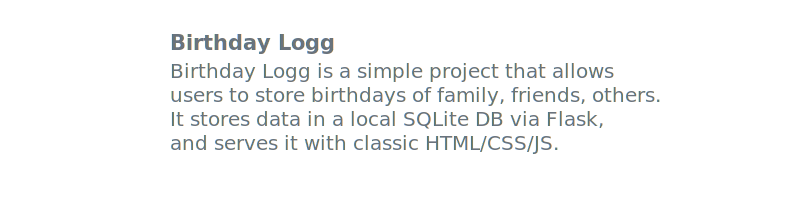
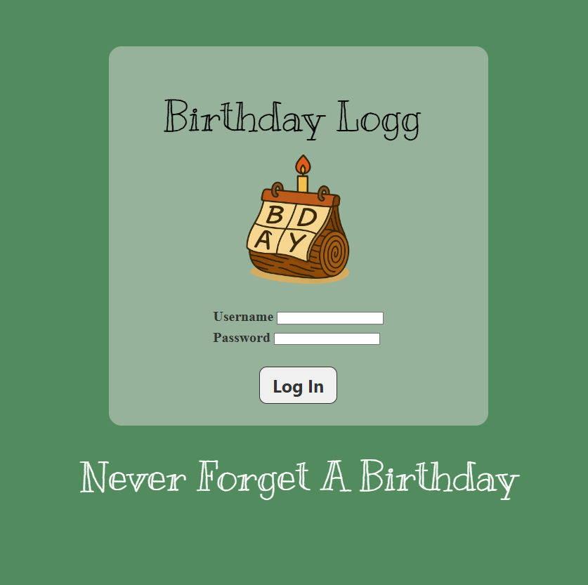
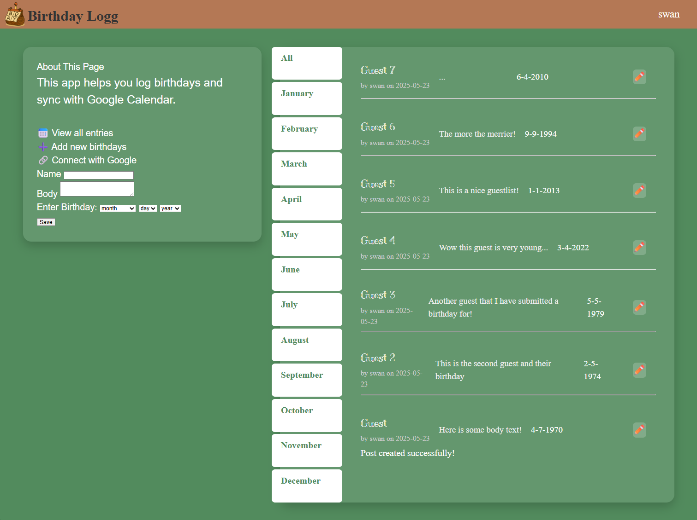

<!-- markdownlint-disable MD009 MD033 MD041 MD047 -->

    <h1>Birthday Logg</h1>
    <a href="https://quart.palletsprojects.com/en/latest/#">Quart</a>
    &nbsp;&nbsp;•&nbsp;&nbsp;
    <a href="https://github.com/swan-e">My Github</a>
    &nbsp;&nbsp;•&nbsp;&nbsp;
    <a href="https://supabase.com/">Supabase</a>
     
    

## Project Description

## Project Images

### Login Page

The login page takes the user inputs after registering on a previous page to login. This is all authenticated through Flask backend and werkzeug security library to store user passwords as hashes (for better passkey protection).  

### Home Page

Once logged in, the user is free to add any users with a body text and a corresponding birthday. This goes into the PostgreSQL database hosted on Supabase and is displayed on the phonebook like area to the right of the entry field. Users can then filter based on birth month by pressing on tabs (the current all tab is pressed showing all the users). 

## Future Updates

<ul>
    <li><h4>Add a simple about page to give users the reason/impetus behind this project</h4></li>
    <li><h4>Create OAuth 2.0 implementation for google workspace connectedness</h4></li>
    <li><h4>Enable API calls to google calendar to automatically add calendar events</h4></li>
    <li><h4>Deploy group labeling functionality to allow categorizing of birthdays</h4></li>
    <li><h4>Host webapp on the web</h4></li>
</ul>
