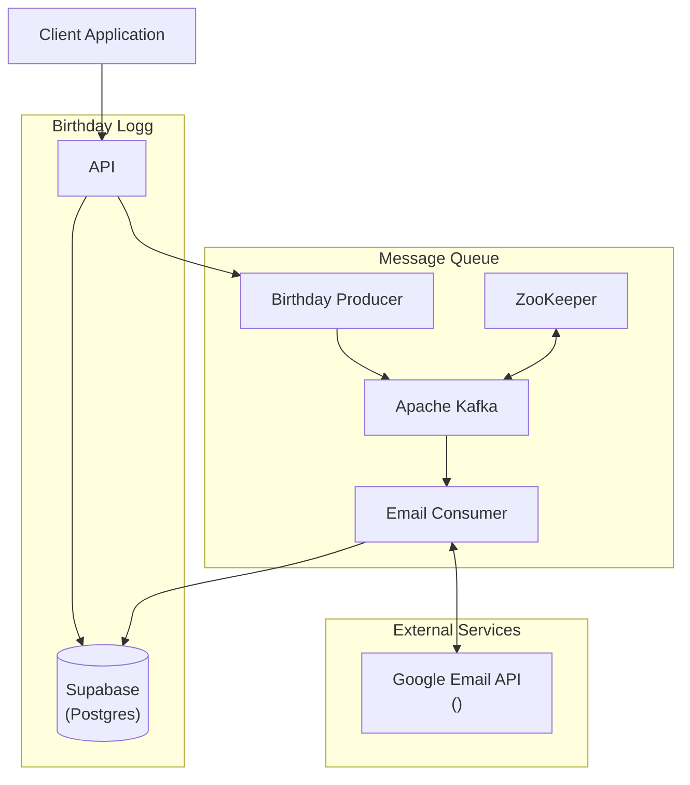

# Architecture Design

## This markdown file goes into detail the design considerations for the software architecture. It will essentially be a document detailing all the choices through the multiple iterations

Here is the current design consideration. This is a MVP (Minimum Viable Product) that utilizes a postgres database connection on supabase

## Birthday Logg

### &emsp; API

&emsp; The API is handled through FastAPI and will call all the necessary functions. The basic implementation will allow for the user to store a birthday to the database. Advanced functionality is allowing the user to set up for email/phone reminders, which will be handled by the Kafka Birthday producer.

### &emsp; Supabase

&emsp; The storage of the birthdays. The API will handle all the logic to store into supabase.

## Message Queue

### &emsp; Birthday Producer

&emsp; This is a simple kafka producer that handles creating the events for the email/phone reminders. This means the topic that is created before hand will have to deal with email/phone reminder events

### &emsp; Apache Kafka

&emsp; The brains of the reminder functionality. It is driving the interaction between the producer and consumer and allowing for decoupling from the Birthday Logg block by handling the logic in the message queue block. This means the API will do its own thing and not worry about the return from the message queue.

### &emsp; Email Consumer

&emsp; THe email consumer is going to handle all the work of creating and sending the email/phone reminders based on what the user wants.

## External Service

### &emsp; Google Email API

&emsp; Simple call to the google email API that will handle all the email reminder/creation logic.
